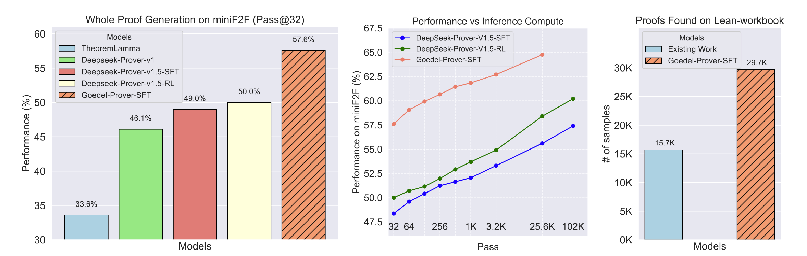

<!-- markdownlint-disable first-line-h1 -->
<!-- markdownlint-disable html -->
<!-- markdownlint-disable no-duplicate-header -->

<!-- Put logo here -->
<!-- <div align="center">
  
</div> -->
<!-- Put logo here -->

<hr>
<div align="center" style="line-height: 1;">
  <a href="https://goedel-lm.github.io/" target="_blank" style="margin: 2px;">
    
  </a>
  <a href="https://huggingface.co/Goedel-LM" target="_blank" style="margin: 2px;">
    
  </a>
</div>

<div align="center" style="line-height: 1;">
  <a href="https://github.com/Goedel-LM/Goedel-Prover/blob/main/LICENSE" style="margin: 2px;">
    
  </a>
  <a href="" style="margin: 2px;">
    
  </a>
</div>
<p align="center">
  <a href="#2-evaluation-results">Evaluation Results</a> |
  <a href="#3-model-downloads">Model Download</a> |
  <a href="#4-setup-environment">Setup Environment</a> |
  <a href="#5-quick-start">Quick Start</a> |
  <a href="#6-questions-and-bugs">Questions and Bugs</a> |
  <a href="#7-license">License</a> |
  <a href="#8-citation">Citation</a> |
  <a href="#9-contact">Contact</a>
</p>


<p align="center">
  <a href="https://arxiv.org/abs/2502.07640"><b>Paper Link</b>👁️</a>
</p>

# Goedel-Prover: A Frontier Model for Open-Source Automated Theorem Proving

## 1. Introduction

We introduce Goedel-Prover, an open-source large language model (LLM) that achieves the state-of-the-art (SOTA) performance in automated formal proof generation for mathematical problems. The key challenge in this field is the scarcity of formalized math statements and proofs, which we tackle in the following ways. We train statement formalizers to translate the natural language math problems from Numina into formal language (Lean 4), creating a dataset of 1.64 million formal statements. LLMs are used to check that the formal statements accurately preserve the content of the original natural language problems. We then iteratively build a large dataset of formal proofs by training a series of provers. Each prover succeeds in proving many statements that the previous ones could not, and these new proofs are added to the training set for the next prover. The final prover outperforms all existing open-source models in whole-proof generation. On the miniF2F benchmark, it achieves a 57.6% success rate (Pass@32), exceeding the previous best open-source model by 7.6%. On PutnamBench, Goedel-Prover successfully solves 7 problems (Pass@512), ranking first on the leaderboard. Furthermore, it generates 29.7K formal proofs for Lean Workbook problems, nearly doubling the 15.7K produced by earlier works.

<p align="center">
  
</p>

**Caption:** The Pass@N metric indicates that we generate N proofs for a single problem; if any one of these N proofs successfully solves the problem, it is considered solved. (Left): The performance of Pass@32 for full proof generation on miniF2F. Due to limited compute, we compare with DeepSeek-Prover-v1.5 on the Pass@32 metric. (Middle): This sub-figure presents a comparison of Goedel-Prover-SFT and Deepseek-Prover-v1.5 in terms of miniF2F performance across different inference budgets, ranging from Pass@32, 64, 128, ..., 4 \* 6400, to 16 \* 6400. The performance numbers of Deepseek-Prover-v1.5 are directly taken from Table 1 of Xin et al. (2024b). Due to computational resource constraints, we tested Goedel-Prover-SFT only up to Pass@4 × 6400. Notably, Goedel-Prover-SFT's Pass@256 already exceeds the Pass@16 \* 6400 performance of Deepseek-Prover-v1.5-RL (without inference time tree search). (Right): The number of problems solved in Lean-workbook by Goedel-Prover-SFT compared to prior works. InternLM2.5-Step-Prover and InternLM-Math-Plus collectively solve and open-source 15.7K samples, while we solve and open-source 29.7K samples.


## 2. Evaluation Results

<div align="center">

| Model |Compute (Pass)|  miniF2F-test  |
|------------------------|------------------|------------------|
| TheoremLamma | 128 | 33.6% |
| DeepSeek-Prover-V1 | 32 | 46.1% |
| DeepSeek-Prover-V1.5-SFT | 32 | 48.2% |
| DeepSeek-Prover-V1.5-RL | 32 | 50.0% |
| **Goedel-Prover-SFT** | **32** | **57.6%** |
|------------------------|------------------|------------------|
| DeepSeek-Prover-V1.5-SFT | 3200 | 53.3% |
| DeepSeek-Prover-V1.5-RL | 3200 | 54.9% |
| **Goedel-Prover-SFT** | **3200** | **62.7%** |
|------------------------|------------------|------------------|
| DeepSeek-Prover-V1.5-SFT | 25600 | 55.8% |
| DeepSeek-Prover-V1.5-RL | 25600 | 58.5% |
| **Goedel-Prover-SFT** | **25600** | **64.7%** |
</div>

**Caption:** Comparison of Goedel-Prover-SFT with existing methods for whole proof generation on miniF2F, assessing performance across various inference time computations.

<div align="center">
MultiDataset

|                       | miniF2F    | ProofNet   | FormalNumina | Lean-workbook | 
|-----------------------|------------|------------|--------------|---------------|
| Deepseek-Prover-v1.5-RL | 50.0%     | **16.0%**  | 54.0%        | 14.7%         |
| **Goedel-Prover-SFT**         | **57.6%**  | 15.2%  | **61.2%**  | **21.2%**  | 
</div>

**Caption:** Comparison of Goedel-Prover-SFT with Deepseek-Prover-v1.5-RL for whole proof generation on miniF2F, ProofNet,FormalNumina,Lean-workbook. We report the Pass@32 performance for miniF2F, ProofNet, and FormalNumina datasets. For the Lean-workbook, we evaluate performance using Pass@16 due to the large number of problems (140K) it contains, allowing us to save on computational costs. FormalNumina is a private test set created by formalizing a randomly sampled collection of 250 problems from Numina.

<div align="center">
Putnam
  
| Ranking | Model                                                 | Type                  | Num-solved | Compute            |
|---------|-------------------------------------------------------|-----------------------|------------|---------------------|
| 1       | **Goedel-Prover-SFT** 🟩      | Whole Proof Generation | 7          | 512                 |
| 1       | ABEL                                           | Tree Search Method     | 7          | 596                 |
| 3       | **Goedel-Prover-SFT** 🟩                                   | Whole Proof Generation | 6          | 32                  |
| 3       | InternLM2.5-StepProver  🟩                       | Tree Search Method     | 6          | 2×32×600            |
| 5       | InternLM 7B                                    | Whole Proof Generation | 4          | 4096                |
| 6       | GPT-4o                                        | Whole Proof Generation | 1          | 10                  |
| 7       | COPRA (GPT-4o) 🟩                                | Whole Proof Generation | 1          | 1                   |
| 8       | ReProver w/ retrieval  🟩                         | Whole Proof Generation | 0          | 1                   |
| 9       | ReProver w/o retrieval  🟩                        | Whole Proof Generation | 0          | 1                   |  
</div>

**Caption:** Our model rank the 1st on [Putnam Leaderboard](https://trishullab.github.io/PutnamBench/leaderboard.html). The performance numbers for existing works are taken from the leaderboard. 🟩  indicates open sourced models.

## 3. Model and Dataset Downloads

We release the Goedel-Prover-SFT with 7B parameters to the public. Goedel-Prover-SFT is finetuned based on DeepSeek-Prover-V1.5-Base.

<div align="center">

|            **Model**            |                          **Download**                         |
| :-----------------------------: | :----------------------------------------------------------: |
|   Goedel-Prover-SFT   | [🤗 HuggingFace](https://huggingface.co/Goedel-LM/Goedel-Prover-SFT) |
</div>

We are also releasing 29,7K proofs of the problems in Lean-workbook found by our Goedel-Prover-SFT.


<div align="center">

|            **Datasets**            |                          **Download**                         |
| :-----------------------------: | :----------------------------------------------------------: |
|   Lean-workbook-proofs   | [🤗 HuggingFace](https://huggingface.co/datasets/Goedel-LM/Lean-workbook-proofs) |
</div>

## 4. Setup Environment

### Requirements

* Supported platform: Linux
* Python 3.10

### Installation

1. **Install Lean 4**

   Follow the instructions on the [Lean 4 installation page](https://leanprover.github.io/lean4/doc/quickstart.html) to set up Lean 4.

2. **Clone the repository**

```sh
git clone --recurse-submodules https://github.com/Goedel-LM/Goedel-Prover.git
cd Goedel-Prover
```

3. **Install dependencies**

```sh
pip install -r requirements.txt
```

4. **Build mathlib4**

```sh
cd mathlib4
lake build
```

5. **Test Lean 4 and mathlib4 installation**

```sh
cd ..
python prover/lean/verifier.py
```
If there is any error, reinstall Lean 4 and rebuild mathlib4.

## 5. Quick Start
<!-- For a quick start with running inference and testing the result on a single problem, run the following command in your terminal:
```sh
sh eval/eval.sh -i datasets/mathd_algebra_338.jsonl -s test -m Goedel-LM/Goedel-Prover-SFT -o results/mathd_algebra_338/Godel-Prover-SFT -n 32 -g 2 -c 32
```
After running the command, the summarized results will be available in `results/mathd_algebra_338/Godel-Prover-SFT/compilation_summarize.json` -->


To run inference on our model and reproduce the performance on miniF2F. You can use `CUDA_VISIBLE_DEVICES=0,1,···` to specify the GPU devices. Here is an example of using two GPUs to evaluate Goedel-LM/Goedel-Prover-SFT on the miniF2F dataset for Pass@32.
```sh
sh eval/eval.sh -i datasets/minif2f.jsonl -s test -m Goedel-LM/Goedel-Prover-SFT -o results/minif2f/Godel-Prover-SFT -n 32 -g 2  -c 128
```
The results is summarized in `results/minif2f/Godel-Prover-SFT/compilation_summarize.json`

Specify the arguments as follows:
* `-i`: the dataset path to evaluate
* `-s`: the split of the dataset to evaluate, usually set to "test" 
* `-m`: model name or path
* `-o`: output directory
* `-n`: number of pass
* `-g`: number of GPUs for inference
* `-c`: number of CPUs for compilation

For a quick start with running inference and testing the result on a single problem, you can replace the `datasets/minif2f.jsonl` by `datasets/mathd_algebra_338.jsonl`.


## 6. Questions and Bugs

To report a potential bug, please open an issue.

## 7. License
This code repository is licensed under the MIT License.

## 8. Citation
```latex
@misc{lin2025goedelproverfrontiermodelopensource,
      title={Goedel-Prover: A Frontier Model for Open-Source Automated Theorem Proving}, 
      author={Yong Lin and Shange Tang and Bohan Lyu and Jiayun Wu and Hongzhou Lin and Kaiyu Yang and Jia Li and Mengzhou Xia and Danqi Chen and Sanjeev Arora and Chi Jin},
      year={2025},
      eprint={2502.07640},
      archivePrefix={arXiv},
      primaryClass={cs.LG},
      url={https://arxiv.org/abs/2502.07640}, 
}
```

## 9. Contact

If you have any questions, please raise an issue or contact us at [yl7690@princeton.edu](mailto:yl7690@princeton.edu) or [shangetang@princeton.edu](mailto:shangetang@princeton.edu).

The primary architecture of this project is based on [DeepSeek-Prover-V1.5-RL](https://github.com/deepseek-ai/DeepSeek-Prover-V1.5.git). Certain sections of the code have been sourced from DeepSeek-Prover-V1.5-RL, as noted within the code files. The copyright for those sections belongs to [DeepSeek-Prover-V1.5](https://github.com/deepseek-ai/DeepSeek-Prover-V1.5.git).
